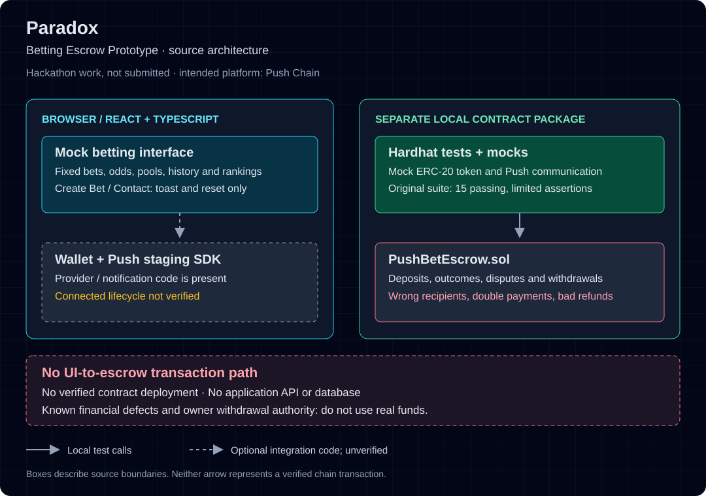

# Paradox — Betting Escrow Prototype

A React/TypeScript interface and a separate Solidity escrow experiment intended for Push Chain. This was hackathon work, **not submitted**; no event, year or award is claimed.

> **Prototype only: do not use real funds.** The UI uses mock betting data and is not connected to the escrow. The contract has known payout and refund defects, including wrong recipients and double-payment accounting. There is no verified contract deployment or working public demo.

## What is here

- A Vite frontend with category filters, sample betting/history/ranking screens, form previews and shared UI components.
- Wallet and Push Protocol staging integration code, separate from the mock betting flow. A connected-wallet lifecycle has not been verified.
- `PushBetEscrow.sol`, ERC-20 and notification mocks, and a Hardhat test suite. `backend/` is a contracts package, not an application API or database.



The GitHub slug remains `Paradox_Betting_Platform`. `PushBet`, `pushbet-frontend` and `PushBetEscrow` are retained legacy identifiers, not separate products.

## Run locally, without a wallet

Use Node.js 22 and npm. From the repository root:

```sh
node --test scripts/test-presentation.mjs
cd frontend
npm ci --ignore-scripts --no-fund --no-audit
npm run build
npm run preview -- --host 127.0.0.1 --port 4361 --strictPort
```

Open `http://127.0.0.1:4361`. No environment file is needed for disconnected browsing. Keep wallets disconnected and use only disposable example text in forms. Create Bet and Contact only show toasts and reset; they do not save or send anything. Prices, pools, users, odds and results are simulated fixtures.

[Local development](docs/local-development.md) includes development, lint, typecheck and local contract-test commands.

## Evidence and limits

The frontend builds, but existing lint and typecheck failures remain. The original contract run reports 15 passing tests; weak assertions leave settlement correctness unproven. Known recipient, accounting, refund and owner-authority risks are documented in [engineering notes](docs/engineering.md).

[Verification evidence](docs/evidence.md) distinguishes fresh presentation checks from retained contract results and historical deployment records. The Vercel deployment inspected required login; it is not offered as a public demo. Dependency audit findings remain unresolved. No repository-wide license file is present; this refresh does not grant a license or change existing file notices.
